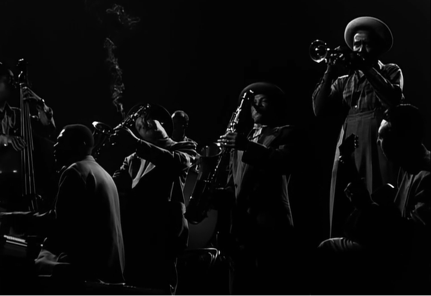

Jammin' the Blues 高畫質重製版

大家有沒有發現，最近出現許多高清、彩色版本的老影片。

今天來介紹剛上的一支高畫質重製版爵士錄影 Jammin' the Blues。

[https://vimeo.com/521861666](https://vimeo.com/521861666)

## Jammin' the Blues

Jammin' the Blues 是一部 1944 年拍攝的短片，提名奧斯卡最佳實景短片(Best Live Action Short Film)，被譽為最偉大的爵士電影之一。

華納兄弟找了攝影師 Gjon Mili 和爵士樂製作人 Norman Granz 聯手，結合最優秀的爵士樂手、舞者，拍攝當年 Jam Session 的情境。

> 爵士樂的 Jam Session 是指沒有預先排練的情況下，在經典樂曲目中，依循曲目裡的和聲進行 (chord progression) 進行即興 (improvise) 的演奏，是樂手之間的術語

演出人

- [Lester Young](https://en.wikipedia.org/wiki/Lester_Young) – Tenor saxophone
- [Red Callender](https://en.wikipedia.org/wiki/Red_Callender) – Bass
- [Harry "Sweets" Edison](https://en.wikipedia.org/wiki/Harry_%22Sweets%22_Edison) – [Trumpet](https://en.wikipedia.org/wiki/Trumpet)
- [Marlowe Morris](https://en.wikipedia.org/wiki/Marlowe_Morris) – [Piano](https://en.wikipedia.org/wiki/Piano)
- "Big" [Sid Catlett](https://en.wikipedia.org/wiki/Sid_Catlett) – Drums (First two songs, and intro of third)
- [Jo Jones](https://en.wikipedia.org/wiki/Jo_Jones) – Drums (for final song)
- [Barney Kessel](https://en.wikipedia.org/wiki/Barney_Kessel) – [Guitar](https://en.wikipedia.org/wiki/Guitar)
- [John Simmons](https://en.wikipedia.org/wiki/John_Simmons_(musician)) – Double bass
- [Illinois Jacquet](https://en.wikipedia.org/wiki/Illinois_Jacquet) – Tenor saxophone
- [Marie Bryant](https://en.wikipedia.org/wiki/Marie_Bryant) – Vocals and Female Dancer
- [Archie Savage](https://en.wikipedia.org/wiki/Archie_Savage) – Male Dancer

### 唯一的白人 Barney Kessel

研究這首歌的過程中，發現樂團中隱藏著唯一的白人樂手，[Barney Kessel](https://en.wikipedia.org/wiki/Barney_Kessel)(1923－2004)。華納當年不希望有白人樂手在樂團裡，因為 40 年代種族隔離主義的影響下，"混血"的樂團仍需要承受一些社會輿論的壓力。

但製作人 Norman Granz 堅持 Barney Kessel 是樂團的最佳人選，華納最後做出妥協，同意 Barney Kessel 的演出但不能在影片中露臉，而且他的手出現在電影片中，也被後製成黑色。

### 舞者 Marie Bryant

Marie Bryant (1919-1978) ，從小熱愛跳舞，20歲的時候已經跟著 Duke Ellington 進行全國性的巡迴演出，同樣在 1944 年曾與 Harold Nicholas 一同演出，裡面有很多筆者喜歡的舞者，有機會再跟大家好好分享。

*Spirit Valencia Lindy Hop 整理好整串 Marie Bryant 的[播放清單](https://www.youtube.com/playlist?list=PL69k6m47R2WbBRrYAxh5iXPekb-y9ExAT)*



### 經典中的經典

身為 Lindy Hopper 怎麼能不喜歡 Jammin' The Blues

先來看看 2020 ILHC 比賽，瑞典舞者如何詮釋這首歌，開頭的片段有致敬老影片的動作唷！

[Frida Segerdahl & Sakarias Larsson 這組表演，看 10 次也不會膩](https://www.youtube.com/watch?v=-A4SnMrlK88&ab_channel=TheInternationalLindyHopChampionships)

Frida Segerdahl & Sakarias Larsson 這組表演，看 10 次也不會膩

歐洲大型活動之一 Lindy Shock 的 Jam circle 也演奏過這首歌

[最後一位上來的 Leader 就是 Jonathan Stout 本人](https://www.youtube.com/watch?v=BMemSfpqySE&ab_channel=SlavaBogatov)

最後一位上來的 Leader 就是 Jonathan Stout 本人

2014 年 Lindy Focus 重新呈現，Marie Bryant 和 Archie Savage 在 Jammin' The Blues 的排舞

[Lindy Focus XII: Part 8 of 9 - "Jammin' Blues" (2014), Lindy Focus 是美國最大的跨年活動](https://www.youtube.com/watch?v=w3sslANV-y8&ab_channel=LindyFocus)

Lindy Focus XII: Part 8 of 9 - "Jammin' Blues" (2014), Lindy Focus 是美國最大的跨年活動

最後一起來聽台灣樂團 The Cat's Corner 演奏的 Jammin' The Blues 

只要你 5/5 參加搖擺之夜就有機會能再次聽到 ([活動連結](https://fb.me/e/1mEdfvuGU))

今天的文章就使用一個業配做結尾，大家還想知道些什麼搖擺舞、爵士樂的主題歡迎留言給我們

